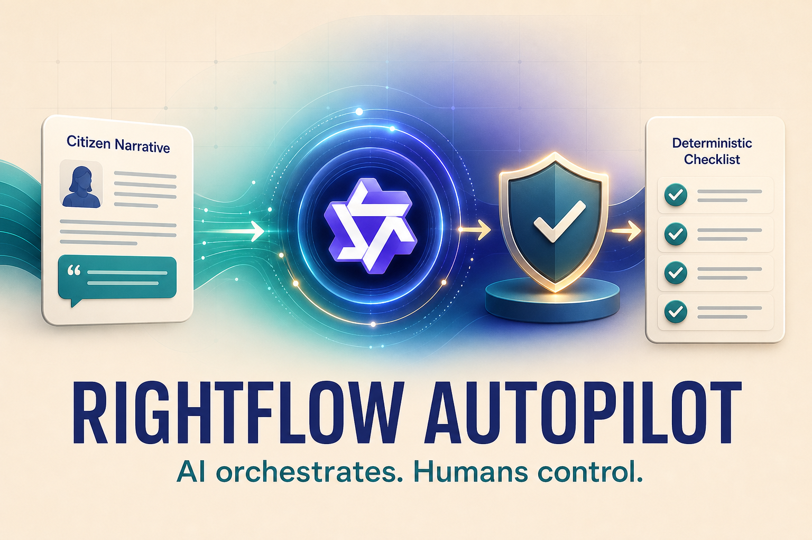
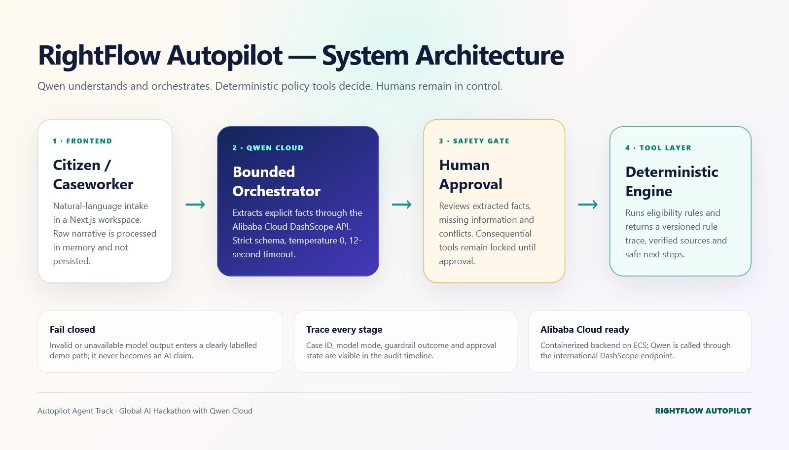
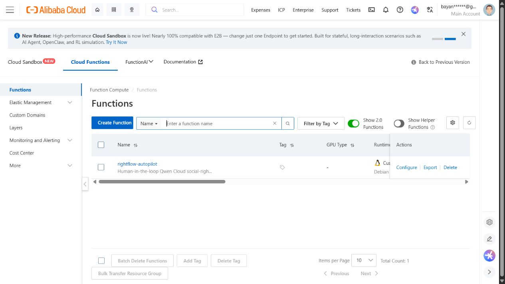

# RightFlow Autopilot

An explainable Qwen-powered social-rights caseworker built for the **Autopilot Agent** track of the Global AI Hackathon with Qwen Cloud.

RightFlow turns an ambiguous citizen narrative into validated case facts. After human approval, deterministic tools identify relevant older-person support, home-care support, and GSS (General Health Insurance) review pathways without issuing an official eligibility decision.



## Live demo

https://rightflutopilot-xuldemxbed.ap-southeast-1.fcapp.run/rightflow-autopilot

## Architecture



1. Qwen 3.7 Plus extracts only explicitly stated facts through Alibaba Cloud DashScope.
2. A strict allowlist validates every model output.
3. A human verifies facts before consequential tool execution.
4. Deterministic screening identifies relevant programs, missing information, and safe next steps.
5. Every stage is recorded in an explainable audit timeline.

## Run locally

```bash
npm ci
cp .env.example .env.local
npm run dev
```

Set `QWEN_API_KEY` in `.env.local`, then open:

```text
http://localhost:3000/rightflow-autopilot
```

Without a key, the app enters a clearly labelled deterministic demo mode. It never represents fallback output as a live Qwen result.

## Verify

```bash
npm test
npm run typecheck
npm run build
```

## Alibaba Cloud deployment

The public demo runs on **Alibaba Cloud Function Compute** in the Singapore region using the free promotional quota. The reproducible deployment manifest is [`deploy/function-compute/s.yaml`](./deploy/function-compute/s.yaml).



The repository also includes an optional container deployment path through [`deploy/ecs-compose.yaml`](./deploy/ecs-compose.yaml).

```bash
docker build -t rightflow-autopilot .
docker run --rm -p 8080:8080 --env-file .env.local rightflow-autopilot
```

The HTTP trigger is public for judging, while the DashScope credential remains a server-side Function Compute environment variable and is never exposed to the browser or repository.

## Safety boundary

- No official eligibility decision or benefit guarantee
- No raw narrative persistence
- Strict fact allowlist and value normalization
- Prompt-injection detection
- Bounded 25-second Qwen timeout
- Human approval before deterministic screening
- Fail-closed fallback

## Significant hackathon update

The competition submission adds a new Qwen Cloud integration, autonomous case-intake API, strict guardrails, human approval checkpoint, three-path deterministic program screening, audit timeline, dedicated UI, automated tests, and Alibaba Cloud deployment package.

## License

Apache-2.0
